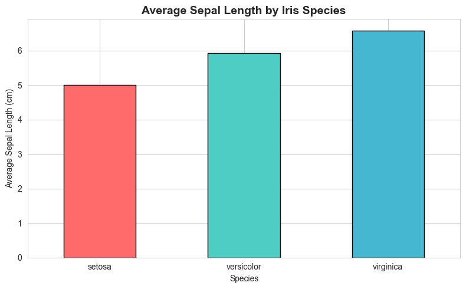
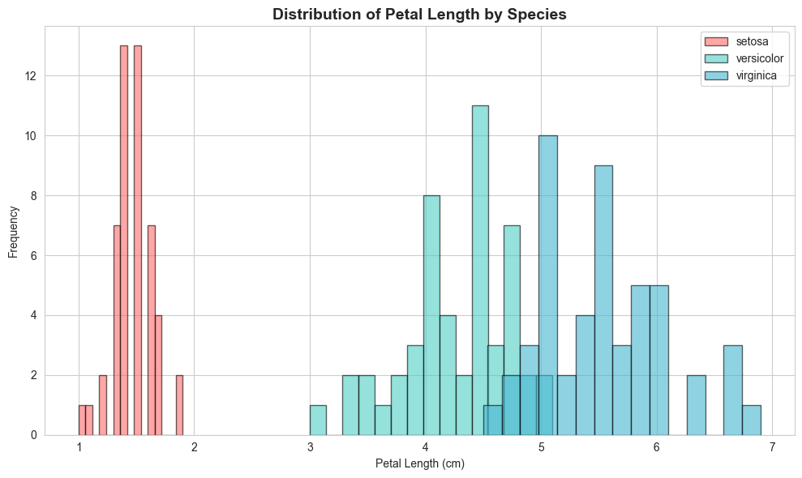
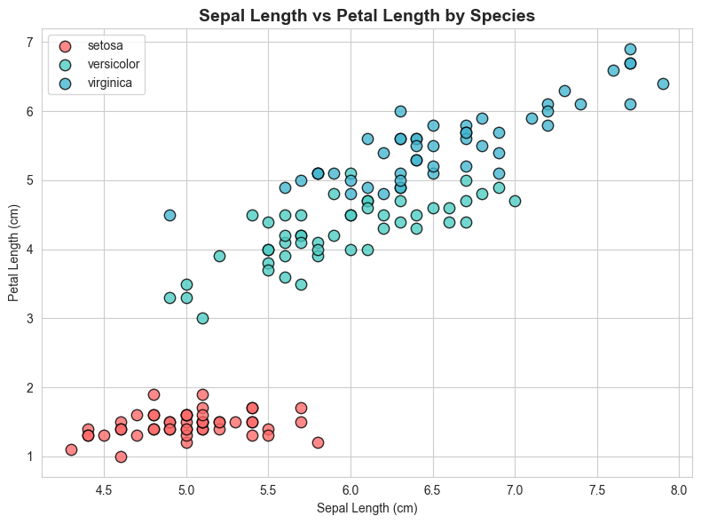
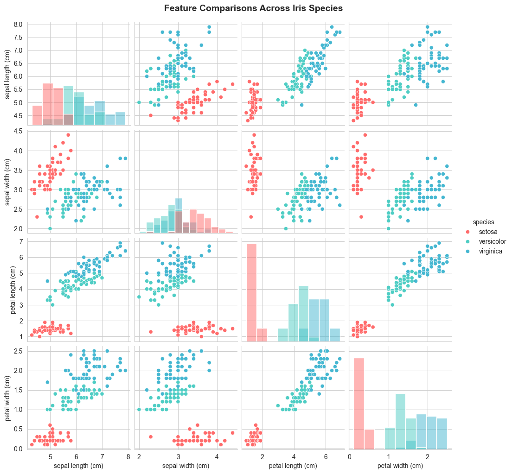
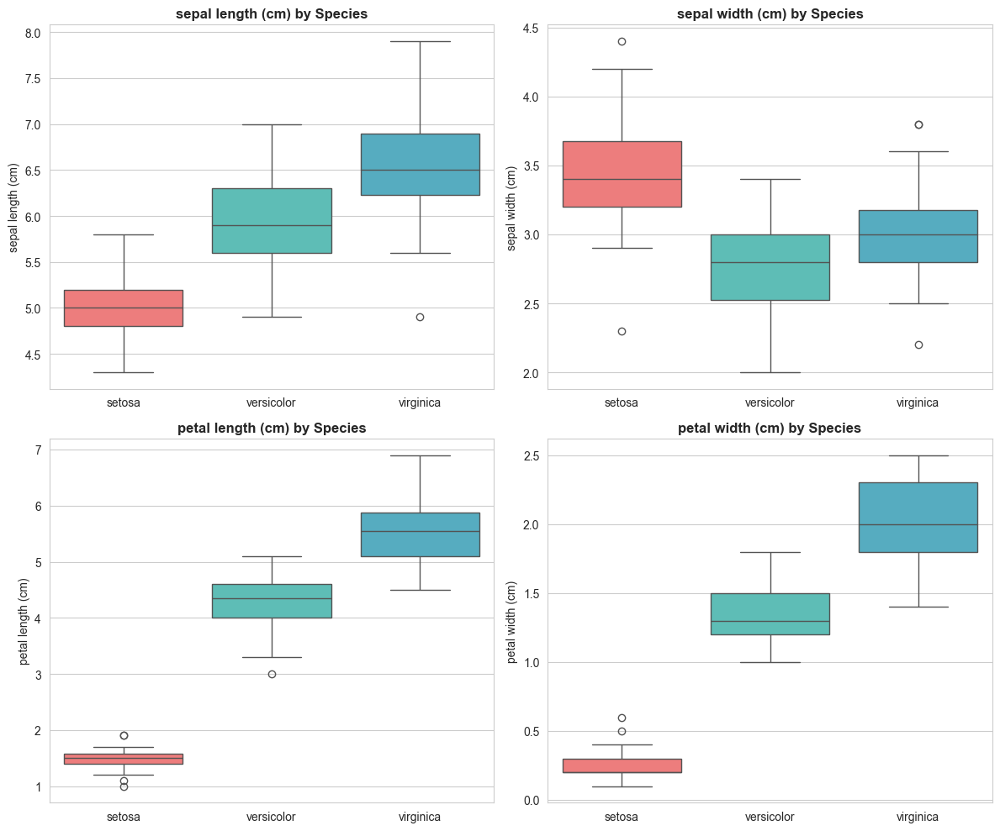
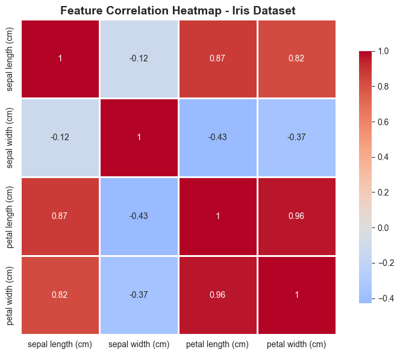

# 🟢 Task 2: Data Visualization – Iris Dataset

**Synent Technologies** – Data Science Internship Program

---

## 👤 Author
**Hajer Ben ghazi**

---

## 📋 Problem Statement

The goal of this task is to explore the **Iris dataset** and create meaningful visualizations to understand the patterns, distributions, and relationships between different features across the three iris species: *Setosa*, *Versicolor*, and *Virginica*.

---

## 📊 Dataset Details

| Property | Description |
|----------|-------------|
| **Dataset** | Iris Dataset |
| **Source** | `sklearn.datasets` / UCI Machine Learning Repository |
| **Instances** | 150 |
| **Features** | Sepal Length, Sepal Width, Petal Length, Petal Width |
| **Target** | Species (Setosa, Versicolor, Virginica) |

---

## 🎯 Objectives

- [x] Create a **Bar Chart** comparing average sepal length per species
- [x] Create a **Histogram** showing petal length distribution
- [x] Create a **Scatter Plot** of sepal length vs petal length
- [x] Compare all features using **Pairplot**
- [x] Create **Boxplots** for all features by species
- [x] Generate a **Correlation Heatmap**

---

## 🛠️ Tools & Libraries

| Tool | Purpose |
|------|---------|
| Python 3.x | Programming Language |
| Pandas | Data manipulation |
| NumPy | Numerical operations |
| Matplotlib | Data visualization |
| Seaborn | Statistical visualizations |
| Scikit-learn | Dataset loading |
| Jupyter Notebook | Development environment |

---

## 📈 Visualizations & Insights

### 1. 📊 Bar Chart – Average Sepal Length by Species


**Insight :** *Virginica* a la plus grande longueur moyenne de sépale (~6.6 cm), suivi de *Versicolor* (~5.9 cm) et *Setosa* (~5.0 cm).

---

### 2. 📊 Histogram – Distribution of Petal Length


**Insight :** *Setosa* a des pétales nettement plus courts (1–2 cm). *Versicolor* et *Virginica* se chevauchent légèrement mais *Virginica* a les pétales les plus longs (5–7 cm).

---

### 3. 📊 Scatter Plot – Sepal Length vs Petal Length


**Insight :** *Setosa* est clairement séparée des deux autres espèces. *Versicolor* et *Virginica* montrent une corrélation positive entre les deux variables.

---

### 4. 📊 Pairplot – Feature Comparisons


**Insight :** *Setosa* est linéairement séparable des autres espèces. *Versicolor* et *Virginica* se chevauchent sur certaines paires de caractéristiques.

---

### 5. 📊 Boxplot – Features by Species


**Insight :** *Virginica* présente la plus grande variabilité dans la plupart des caractéristiques. *Setosa* a des mesures plus compactes.

---

### 6. 📊 Correlation Heatmap


**Insight :** Forte corrélation positive entre :
- Petal Length & Petal Width (0.96)
- Petal Length & Sepal Length (0.87)
- Petal Width & Sepal Length (0.82)

---

## 📌 Key Takeaways

1. **Setosa** est l'espèce la plus distincte et facilement séparable
2. **Petal Length** et **Petal Width** sont les caractéristiques les plus discriminantes
3. Forte corrélation entre les dimensions des pétales et la longueur des sépales
4. **Virginica** est la plus grande espèce en termes de dimensions florales

---

## 🚀 How to Run

```bash
# Clone the repository
git clone https://github.com/hajerbgh/synent-task2-irisvisualization-HajerBenghazi.git

# Navigate to the directory
cd synent-task2-irisvisualization-hajer

# Install dependencies
pip install -r requirements.txt

# Open Jupyter Notebook
jupyter notebook iris_visualization.ipynb
